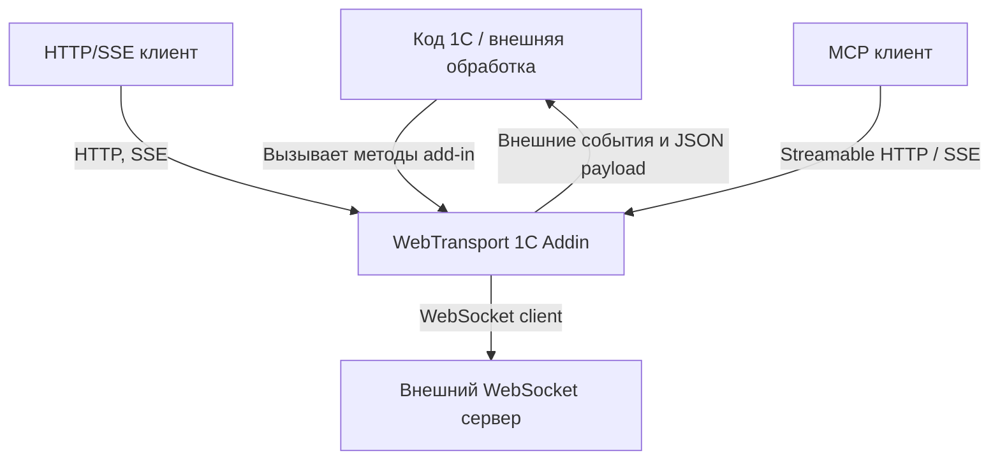
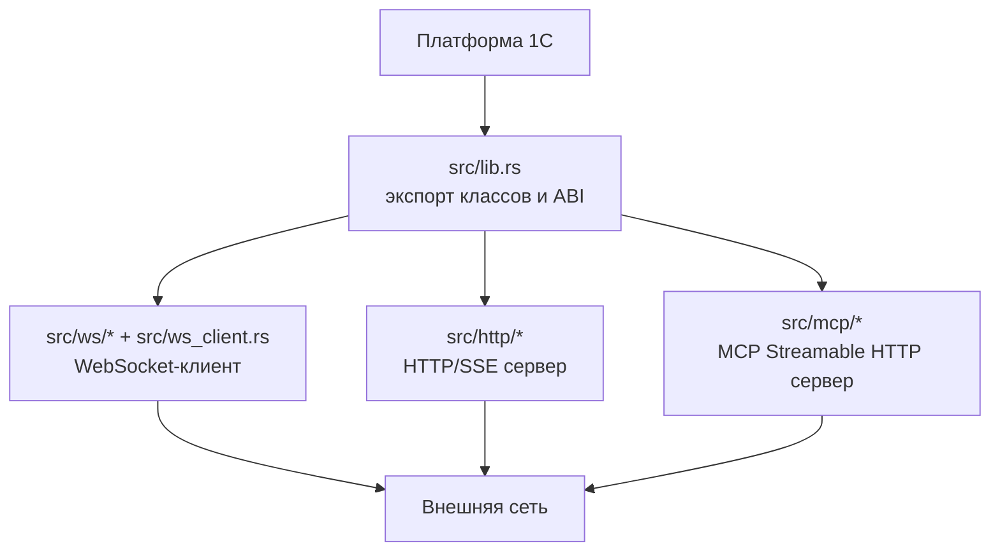
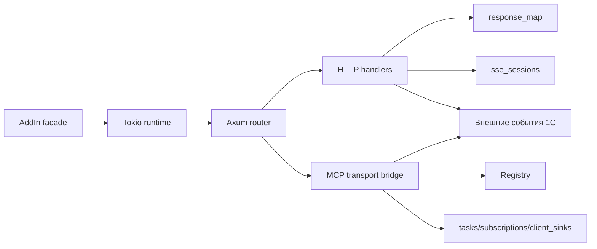
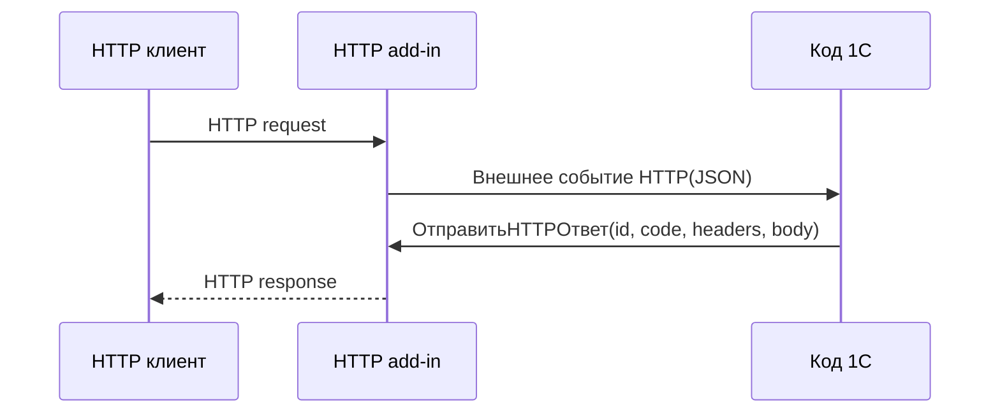
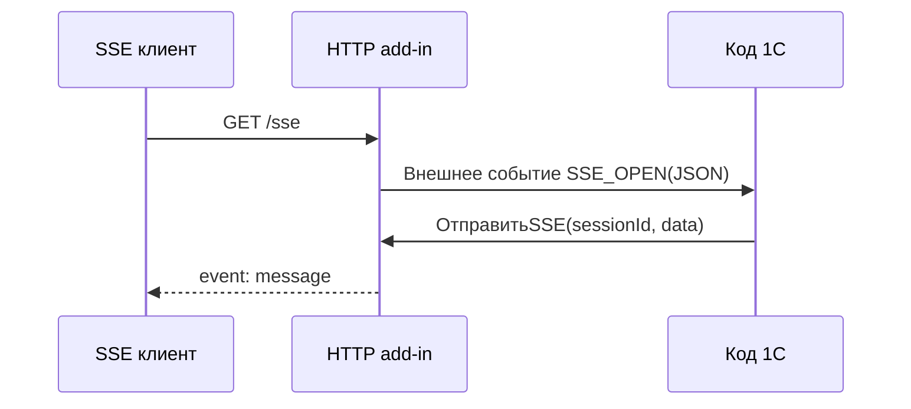
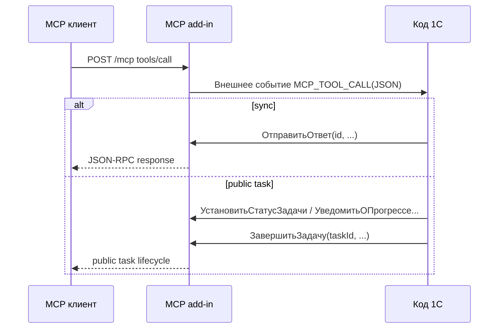
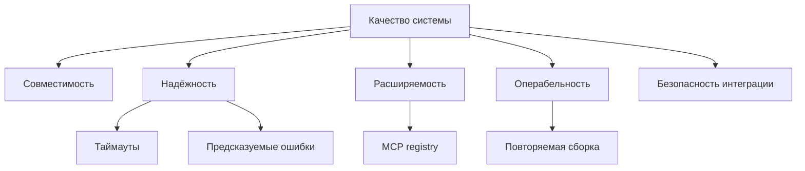

# Архитектурная документация (arc42)

**Проект:** WebTransport 1C Addin
**Версия:** 0.6.3
**Дата:** 2026-04-03
**Статус:** Draft

---

## 1. Введение и цели

### 1.1 Обзор требований

`webtransport` это внешняя компонента для 1С, реализованная на Rust и поставляемая как native add-in. Компонента предоставляет единый пакет с тремя экспортируемыми классами:

- `ws`: WebSocket-клиент для исходящих подключений из 1С.
- `http`: HTTP/SSE сервер, который принимает HTTP-запросы и пробрасывает их в 1С через внешние события.
- `mcp`: MCP Streamable HTTP сервер, который публикует инструменты, ресурсы, шаблоны ресурсов и промпты, а выполнение бизнес-логики делегирует в 1С.

Функциональные драйверы:

- дать коду 1С доступ к современным сетевым протоколам без отдельного внешнего сервиса-посредника;
- сохранить привычную для 1С модель обработки через методы компоненты и внешние события;
- объединить несколько транспортных сценариев в одном бинарном артефакте и одном manifest bundle;
- обеспечить работу как минимум на Windows и Linux в 32- и 64-битных вариантах.

Подробные пользовательские интерфейсы описаны в:

- [README.md](/home/alko/develop/open-source/websocket1c/README.md)
- [docs/ws.md](/home/alko/develop/open-source/websocket1c/docs/ws.md)
- [docs/http.md](/home/alko/develop/open-source/websocket1c/docs/http.md)
- [docs/mcp.md](/home/alko/develop/open-source/websocket1c/docs/mcp.md)

### 1.2 Цели качества

| Приоритет | Цель качества | Сценарий |
|----------|---------------|----------|
| 1 | Совместимость с 1С | Разработчик 1С подключает один bundle и получает классы `ws`, `http`, `mcp` через `Новый("AddIn.*")` без отдельного демона или IPC слоя. |
| 2 | Предсказуемость интеграции | Ошибки методов возвращаются как исключения/`ОписаниеОшибки`, а входящие запросы и события имеют стабильный JSON-формат. |
| 3 | Поддержка длительных и потоковых сценариев | HTTP/SSE и MCP task-based вызовы работают без блокировки UI-логики 1С дольше одного синхронного вызова. |
| 4 | Портируемость поставки | Сборка формирует bundle для Windows/Linux/macOS с версией в имени: `WebTransportAddIn-{version}.zip` и `Manifest.xml`, который ссылается на DLL/SO/DYLIB с той же версией. |
| 5 | Расширяемость | MCP-слой позволяет регистрировать инструменты, ресурсы, шаблоны ресурсов и промпты без изменения транспортного ядра. |

### 1.3 Заинтересованные стороны

| Роль | Ожидания | Основные вопросы |
|------|----------|------------------|
| Разработчик 1С | Простой API компоненты, понятные события, предсказуемые таймауты | Как обрабатывать запросы, ошибки и долгие операции |
| Разработчик Rust/maintainer | Чистые границы между транспортами, минимальная связность, удобство расширения | Как не ломать совместимость API и сборки |
| Архитектор интеграции | Единый способ подключить WebSocket/HTTP/MCP в контур 1С | Где границы ответственности между Rust и 1С |
| Эксплуатация/DevOps | Повторяемая сборка и понятная поставка | Какие бинарники входят в пакет и как собирается demo |
| Потребитель MCP/HTTP API | Стабильные протоколы, корректные ответы, CORS/origin-control | Какие режимы ответов и ограничения поддерживаются |

---

## 2. Ограничения

### 2.1 Технические ограничения

| Ограничение | Основание |
|------------|-----------|
| Компонента должна быть native add-in для 1С | Платформенная модель интеграции через `addin1c` и export-функции `GetClassObject`, `GetClassNames`, `DestroyObject` |
| Библиотека собирается как `cdylib` | Требование нативной поставки DLL/SO для 1С |
| Основной стек реализации: Rust 2021 + Tokio | Зафиксировано в [Cargo.toml](/home/alko/develop/open-source/websocket1c/Cargo.toml) и текущем коде |
| HTTP и MCP реализованы поверх `axum` | Уже выбранная серверная библиотека |
| MCP transport реализован через `rmcp` Streamable HTTP | Это определяет supported endpoints, sessions и SSE semantics |
| Опциональная валидация схем инструментов зависит от feature `validate-schema` | Поведение сборки меняется feature-флагом, а не конфигурацией рантайма |

### 2.2 Организационные ограничения

| Ограничение | Основание |
|------------|-----------|
| Документация должна опираться на фактический код и существующие `docs/*.md` | В репозитории нет отдельной спецификации требований |
| Демо-поставка зависит от локальной установленной 1С и файловой ИБ | Скрипт [scripts/build-epf.sh](/home/alko/develop/open-source/websocket1c/scripts/build-epf.sh) требует `1cv8` и `ONEC_IB_PATH` |
| Релизная упаковка ожидает наличие `cargo-make`, `cargo` и `zip` | Зафиксировано в [scripts/build-release.sh](/home/alko/develop/open-source/websocket1c/scripts/build-release.sh) |

### 2.3 Соглашения

| Соглашение | Описание |
|-----------|----------|
| Документация в Markdown | Проект уже документирован через `README.md` и `docs/*.md` |
| Публичный API методов на русском | Имена методов и свойств add-in ориентированы на код 1С |
| JSON как формат обмена | Заголовки, тела событий и MCP payloads передаются как JSON-строки |
| Внешние события 1С как точка интеграции | Для `http` и `mcp` входящие запросы переводятся в события `HTTP`, `SSE_OPEN`, `MCP_*` |

---

## 3. Контекст и границы системы

### 3.1 Бизнес-контекст

Система является библиотекой-интегратором между кодом 1С и внешними сетевыми клиентами/серверами. Она не содержит бизнес-логики предметной области: бизнес-решения, тексты ответов и обработка входных команд остаются на стороне 1С.



Партнёры взаимодействия:

| Партнёр | Вход в систему | Выход из системы |
|---------|----------------|------------------|
| Код 1С | Вызовы методов `ws/http/mcp`, регистрация инструментов и ответов | Ошибки, результаты методов, внешние события |
| WebSocket сервер | Принимает исходящее соединение и сообщения | Отправляет ответные WebSocket сообщения |
| HTTP клиент | Отправляет HTTP-запросы или открывает SSE-подключение | Получает HTTP-ответы и SSE-события |
| MCP клиент | Выполняет `initialize`, `tools/call`, `resources/read`, `prompts/get`, tasks API | Получает JSON-RPC ответы, SSE-поток и server notifications |

### 3.2 Технический контекст

| Интерфейс | Назначение | Протокол / формат |
|-----------|------------|-------------------|
| Экспортируемые классы add-in | Точка входа из 1С | Native add-in ABI, методы/свойства 1С |
| WebSocket client | Исходящие подключения к внешним WS-серверам | WebSocket |
| HTTP server | Приём HTTP-запросов и SSE-сессий | HTTP/1.1, SSE, JSON, plain text |
| MCP server | Публикация MCP Streamable HTTP endpoint | HTTP, SSE, JSON-RPC, MCP |
| Build/release pipeline | Сборка бинарников, генерация `Manifest.xml` и ZIP-пакета | Cargo, cargo-make, shell scripts |

Граница ответственности:

- Rust-часть отвечает за транспорт, сетевые сокеты, таймауты, сессии, маршрутизацию и маршаллинг данных.
- 1С отвечает за прикладную обработку событий, регистрацию MCP-сущностей и формирование бизнес-ответов.

---

## 4. Стратегия решения

| Цель качества | Архитектурный подход | Обоснование |
|--------------|----------------------|-------------|
| Совместимость с 1С | Один `cdylib` с тремя классами и единым lifecycle | Упрощает подключение и уменьшает число артефактов для пользователя |
| Предсказуемость интеграции | Все transport-модули скрывают асинхронность за синхронными методами add-in и внешними событиями | Модель взаимодействия остаётся естественной для кода 1С |
| Длительные сценарии | Tokio runtime создаётся внутри каждого add-in и обслуживает async IO, SSE и MCP tasks | Позволяет совмещать синхронный API 1С и неблокирующие сетевые операции |
| Расширяемость MCP | Отдельный реестр `Registry` и явные методы регистрации инструментов/ресурсов/промптов | Новые MCP сущности добавляются без изменения HTTP transport слоя |
| Портируемость поставки | Release pipeline собирает DLL/SO для 4 целевых платформ, переименовывает их с версией пакета, генерирует `out/Manifest.xml` и формирует `WebTransportAddIn-{version}.zip` | Один bundle с версией в имени закрывает основные сценарии поставки в 1С-среды и упрощает хранение релизов |

Ключевые технологические решения:

- `addin1c` для интеграции с native API платформы 1С.
- `tokio` как общий async runtime.
- `tokio-tungstenite` для WebSocket-клиента.
- `axum` для HTTP-роутинга и SSE endpoint-ов.
- `rmcp` для MCP Streamable HTTP server.
- `serde`/`serde_json` для JSON-маршаллинга.

Архитектурные паттерны:

- адаптер к платформе 1С через три фасада `WsAddIn`, `HttpAddIn`, `McpAddIn`;
- разделение на transport layer и registry/state management;
- event-driven интеграция с кодом 1С;
- in-memory state для correlation id, SSE sessions, subscriptions и task lifecycle.

---

## 5. Представление строительных блоков

### 5.1 Уровень 1: обзор системы



Основные блоки:

| Блок | Ответственность | Основные интерфейсы |
|------|------------------|---------------------|
| `src/lib.rs` | Экспорт ABI, выбор класса add-in, общие helper-функции | `GetClassObject`, `GetClassNames`, `parse_headers` |
| `src/ws/*` | Подключение к WebSocket серверу, отправка и чтение сообщений | Методы `Подключиться`, `ОтправитьСообщение`, `ПолучитьСообщение`, `Отключиться` |
| `src/http/*` | HTTP-роутинг, correlation запрос-ответ, SSE-сессии, bridge в 1С | Методы `ЗапуститьHTTP`, `ОтправитьHTTPОтвет`, `ОтправитьSSE`, `ЗакрытьSSE`, событие `HTTP` |
| `src/mcp/*` | MCP transport, registry, task support, notifications, origin control | Методы запуска/остановки, регистрации сущностей, событий `MCP_*` |
| `src/addin_error.rs` | Репортинг ошибок в платформу | `ОписаниеОшибки`, platform error reporting |

### 5.2 Уровень 2: внутреннее устройство HTTP и MCP



Подкомпоненты:

- `WsAddIn` и `ws_client`: thin facade над WebSocket соединением и runtime.
- `HttpAddIn`: хранит runtime, `response_map`, счётчики запросов и `sse_sessions`.
- `src/http/server.rs`: поднимает `axum` listener, публикует `/`, `/sse`, `/message`, fallback для HTTP запросов.
- `src/http/mcp_handler.rs`: отдельный bridge для сценария POST `/message`, связанного с MCP сообщениями в HTTP модуле.
- `McpAddIn`: фасад методов управления сервером, allow-list, registry, tasks и ответами.
- `src/mcp/server.rs`: Streamable HTTP transport, task lifecycle, origin checks, notifications.
- `src/mcp/registry.rs`: in-memory реестр инструментов, ресурсов, шаблонов ресурсов и промптов.
- `src/mcp/resource_template.rs`: разбор и сопоставление subset RFC 6570 для URI templates.

### 5.3 Уровень 3: ключевые состояния

| Состояние | Где хранится | Назначение |
|----------|--------------|------------|
| WebSocket connection | `WsAddIn.websocket` | Активное клиентское соединение |
| HTTP response waiters | `HttpServerState.response_map` | Корреляция входящего HTTP-запроса и ответа из 1С |
| SSE sessions | `HttpAddIn.sse_sessions` | Активные SSE-каналы и отправители сообщений |
| MCP pending responses | `McpAddIn.response_map` | Синхронные MCP ответы, ожидающие завершения из 1С |
| MCP registry | `McpAddIn.registry` | Опубликованные инструменты, ресурсы, templates и prompts |
| MCP tasks | `McpAddIn.tasks` | Публичные задачи и внутренние task entries для SSE bridge |
| MCP subscriptions/client sinks | `subscriptions`, `client_sinks` | Server-initiated notifications и resource updates |

---

## 6. Представление выполнения

### 6.1 Сценарий: HTTP-запрос через 1С

**Описание:** HTTP клиент отправляет запрос на встроенный сервер. Rust-компонента публикует внешнее событие в 1С, затем ждёт ответ от кода 1С и возвращает его клиенту.



Шаги:

1. `axum` принимает HTTP-запрос и читает тело.
2. Сервер присваивает request id и сохраняет sender в `response_map`.
3. В 1С отправляется событие `HTTP` с JSON-описанием запроса.
4. Код 1С формирует ответ и вызывает `ОтправитьHTTPОтвет`.
5. Rust снимает waiter из `response_map` и возвращает HTTP-ответ клиенту.
6. Если ответ не получен за 30 секунд, клиент получает `504`.

### 6.2 Сценарий: открытие SSE-сессии



Шаги:

1. Клиент открывает `GET /sse`.
2. Сервер создаёт `sessionId`, сохраняет sender в `sse_sessions`.
3. В 1С публикуется событие `SSE_OPEN`.
4. 1С может отправлять сообщения методом `ОтправитьSSE`.
5. По `ЗакрытьSSE` или разрыву соединения сессия удаляется.

### 6.3 Сценарий: MCP `tools/call`



Шаги:

1. MCP transport принимает запрос на `/mcp`.
2. Сервер проверяет allow-list для `Origin` и поддерживаемый режим вызова.
3. Для `tools/call` генерируется событие `MCP_TOOL_CALL`.
4. Для `taskSupport = "forbidden"` вызов обрабатывается синхронно, для `taskSupport = "optional"` клиент сам выбирает между plain `tools/call` и `tasks/*`, а для `taskSupport = "required"` допускается только клиентский task flow.
5. Со стороны 1С task lifecycle используется только для публичных MCP-задач, а transport `text/event-stream` остаётся деталью реализации Streamable HTTP.

---

## 7. Представление развёртывания

### 7.1 Инфраструктура поставки

```mermaid
graph TB
    Repo[Репозиторий проекта]
    Cargo[Cargo / cargo-make]
    Targets[4 target binaries]
    Manifest[generated out/Manifest.xml]
    Zip[WebTransportAddIn-{version}.zip]
    OneC[Среда 1С]
    Demo[Demo.epf]

    Repo --> Cargo
    Cargo --> Targets
    Cargo --> Manifest
    Targets --> Zip
    Manifest --> Zip
    Zip --> OneC
    Zip --> Demo
```

Узлы развёртывания:

| Узел | Описание | Технология |
|------|----------|------------|
| Рабочая станция/CI | Сборка native библиотеки | Rust toolchain, cargo, cargo-make |
| Bundle archive | Пакет поставки | `out/WebTransportAddIn-{version}.zip` + generated `out/Manifest.xml` |
| Платформа 1С | Среда исполнения внешней компоненты | Windows/Linux/macOS, 1С native add-in |
| Demo processing | Тестовая внешняя обработка | `Demo.epf`, собирается через Designer |

### 7.2 Варианты артефактов

Содержимое bundle:

- `WebTransportAddIn_x32-{version}.dll`
- `WebTransportAddIn_x64-{version}.dll`
- `WebTransportAddIn_x32-{version}.so`
- `WebTransportAddIn_x64-{version}.so`
- `WebTransportAddIn_x64-{version}.dylib`
- `Manifest.xml`

Особенности:

- Shell-ветки в [Makefile.toml](/home/alko/develop/open-source/websocket1c/Makefile.toml) собирают цели `i686/x86_64` для Windows GNU и Linux GNU, а также `x86_64-apple-darwin` для macOS.
- `pack-to-zip` вычисляет версию пакета через `cargo pkgid`, собирает `out/WebTransportAddIn-{version}.zip` и оставляет совместимый alias `out/WebTransportAddIn.zip`.
- Во время релизной упаковки манифест генерируется в `out/Manifest.xml` и содержит имена DLL/SO/DYLIB с версией пакета; [Manifest.xml](/home/alko/develop/open-source/websocket1c/Manifest.xml) из репозитория остаётся шаблоном для локальных/dev сценариев.
- Скрипт [scripts/build-release.sh](/home/alko/develop/open-source/websocket1c/scripts/build-release.sh) по умолчанию ожидает архив с версией в имени и дополнительно обновляет шаблон компоненты внутри demo.
- Скрипт [scripts/build-epf.sh](/home/alko/develop/open-source/websocket1c/scripts/build-epf.sh) требует локальную установленную платформу 1С и путь к инфобазе.

---

## 8. Сквозные концепции

### 8.1 Управление ошибками

- Каждый add-in хранит `last_error` и публикует его через свойство `ОписаниеОшибки`.
- Ошибки дополнительно репортятся в платформу через `report_platform_error`.
- Некорректные параметры методов возвращаются как ошибки add-in, а не скрываются.

### 8.2 Асинхронность и синхронная оболочка

- Каждый фасад add-in создаёт собственный `tokio::Runtime`.
- Сетевые операции выполняются асинхронно, но наружу exposed как методы 1С.
- Для bridging используются `oneshot`, `mpsc` и shared state на `Arc<Mutex<...>>` / `RwLock`.

### 8.3 Корреляция запросов и ответов

- Для HTTP и MCP синхронные ответы сопоставляются через строковые идентификаторы и in-memory maps.
- Для SSE и MCP task-based операций используются отдельные идентификаторы сессий/публичных задач.
- Потерянные или просроченные ответы удаляются из карт ожидания.

### 8.4 Управление доступом

- HTTP модуль добавляет CORS headers.
- MCP модуль использует allow-list по `Origin`, по умолчанию ограниченный localhost/127.0.0.1.
- Разрешённые Origins можно менять на лету методом `УстановитьРазрешенныеOrigins`.

### 8.5 Контракт JSON

- Заголовки в методах add-in передаются JSON-строкой и приводятся к `HashMap<String, String>`.
- Входящие события в 1С всегда сериализуются как JSON.
- Для MCP ответов тело должно быть валидным JSON.

### 8.6 Регистрация расширений MCP

- Инструменты, ресурсы, шаблоны ресурсов и промпты регистрируются в runtime.
- Реестр хранится в памяти и доступен через методы `register/remove/clear/list`.
- При включённой feature `validate-schema` input schema инструмента валидируется через JSON Schema.

---

## 9. Архитектурные решения

Ключевые решения, зафиксированные кодом и текущей документацией:

| Решение | Обоснование | Статус |
|---------|-------------|--------|
| Объединить `ws`, `http` и `mcp` в один bundle | Упрощает поставку и повторное использование в 1С | Реализовано |
| Делегировать прикладную обработку в 1С через внешние события | Позволяет не дублировать бизнес-логику на Rust | Реализовано |
| Использовать `axum` + `tokio` для HTTP/MCP части | Даёт единый async стек для серверных сценариев | Реализовано |
| Реализовать MCP через `rmcp` Streamable HTTP transport | Снижает объём собственной протокольной логики | Реализовано |
| Хранить runtime state in-memory | Достаточно для embed-сценария внешней компоненты без отдельного persistence слоя | Реализовано |
| Отказаться от внутренней эмуляции задач и оставить только стандартные MCP execution paths | Упрощает bridge с 1С и убирает component-specific semantics поверх MCP | Реализовано через ADR-0002 |
| Включить macOS x86-64 в единый release bundle | Позволяет 1С на macOS загрузить `dylib` из того же ZIP/Manifest, что и Windows/Linux артефакты | Реализовано через ADR-0003 |

Связанные ADR:

- [ADR-0002: Отказаться от внутренней эмуляции задач в MCP bridge](/home/alko/develop/open-source/websocket1c/docs/decisions/0002-drop-internal-task-emulation-in-mcp-bridge.md)
- [ADR-0003: Добавить macOS x86_64 в release bundle внешней компоненты](/home/alko/develop/open-source/websocket1c/docs/decisions/0003-add-macos-x86-64-release-artifact.md)

---

## 10. Требования к качеству

### 10.1 Дерево качества



### 10.2 Конкретные сценарии качества

| Атрибут | Сценарий | Ожидаемое поведение |
|---------|----------|---------------------|
| Совместимость | Разработчик подключает ZIP bundle с версией в имени в 1С на Windows, Linux или macOS x86-64 | Платформа загружает подходящий DLL/SO/DYLIB по путям из `Manifest.xml` внутри bundle |
| Надёжность | 1С не отвечает на HTTP-запрос вовремя | Клиент получает `504`, зависший waiter очищается |
| Надёжность | Для неизвестного `taskId` приходит команда завершения | Метод возвращает `Ложь`, а не повреждает состояние сервера |
| Расширяемость | Нужно добавить новый MCP tool | 1С регистрирует его через JSON-описание без модификации transport слоя |
| Безопасность интеграции | MCP запрос приходит с неразрешённого Origin | Запрос отклоняется allow-list логикой |
| Эксплуатация | Нужно выпустить новую версию пакета | Release pipeline собирает 5 бинарников, генерирует `Manifest.xml` с путями, содержащими версию пакета, и формирует `WebTransportAddIn-{version}.zip` |

---

## 11. Риски и технический долг

| Риск / долг | Влияние | Комментарий |
|-------------|---------|-------------|
| Отсутствуют формализованные ADR | Сложнее объяснять причины архитектурных решений и их эволюцию | Стоит добавить ADR-практику |
| Runtime state хранится только в памяти | Потеря состояния при выгрузке компоненты или перезапуске процесса | Это приемлемо для текущего embed-сценария, но ограничивает recovery |
| Для каждого add-in создаётся отдельный Tokio runtime | Дополнительный overhead и потенциальная неоднородность поведения | Возможна будущая консолидация runtime |
| CORS/Origin политика есть не для всех сценариев одинакового уровня строгости | HTTP и MCP имеют разную модель защиты | Может потребоваться унификация требований безопасности |
| Набор пользовательской документации фрагментирован по трём файлам | Архитектурная картина до этого не была собрана в одном месте | Текущий arc42-документ закрывает этот пробел |
| Нет явного описания production monitoring/logging | Эксплуатационные сценарии зависят от логов 1С и ошибок add-in | При росте использования стоит формализовать observability |

---

## 12. Глоссарий

| Термин | Значение |
|--------|----------|
| 1С | Платформа, в которую загружается внешняя компонента |
| Внешняя компонента / add-in | Нативная библиотека, расширяющая возможности 1С |
| `ws` | Экспортируемый класс add-in для WebSocket-клиента |
| `http` | Экспортируемый класс add-in для HTTP/SSE сервера |
| `mcp` | Экспортируемый класс add-in для MCP Streamable HTTP сервера |
| SSE | Server-Sent Events, однонаправленный поток событий от сервера к клиенту |
| MCP | Model Context Protocol |
| Streamable HTTP | Транспорт MCP поверх HTTP/SSE, поддерживаемый библиотекой `rmcp` |
| allow-list | Список допустимых `Origin` для MCP запросов |
| task-based execution | Режим MCP-вызова, где результат возвращается асинхронно через lifecycle задачи |
| resource template | Шаблон URI ресурса с параметрами, сопоставляемый при `resources/read` |
